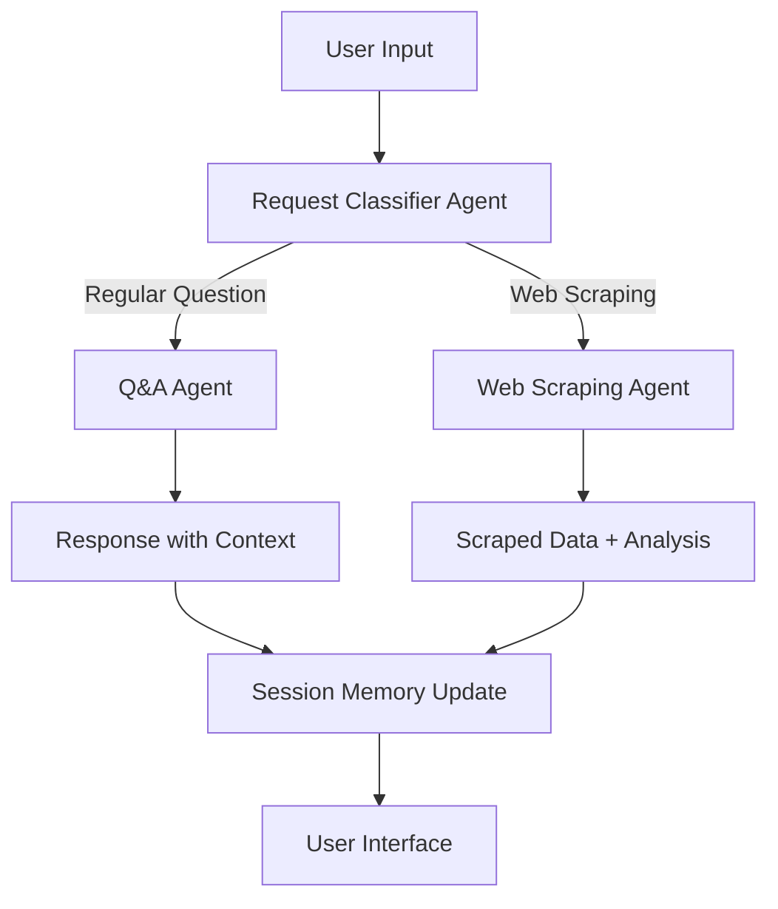

# 🤖 Multi-Agent Chat System with Web Interface

A sophisticated AI chat system powered by OpenAI's Agents SDK with FastAPI backend and modern web interface. Features multi-agent workflow, web scraping capabilities, and persistent conversation memory.

## ✨ Features

### 🧠 **Multi-Agent Intelligence**
- **Request Classifier**: Automatically determines if user wants Q&A or web scraping
- **Q&A Agent**: Handles general questions with context awareness
- **Web Scraping Agent**: Extracts and analyzes data from websites (10K token limit)

### 💬 **Advanced Chat Capabilities**
- **Session Memory**: Remembers conversation context across messages
- **Follow-up Questions**: Ask "What about that?" and AI understands context
- **Persistent Storage**: Conversations saved in SQLite database
- **Real-time Interface**: Modern web-based chat UI
- **Enhanced Progress Tracking**: Shows step-by-step AI processing in real-time

### 🔄 **Interactive Progress Display**
- **🤖 Initializing**: Starting AI analysis
- **🔍 Analyzing**: Determining question type (regular vs scraping)
- **📚 Processing**: Generating answers for regular questions
- **🕷️ Scraping**: Extracting data from websites
- **🧠 AI Analysis**: Processing scraped content with AI
- **📋 Finalizing**: Formatting and preparing response
- **✅ Completed**: Response ready for user

### 🕷️ **Web Scraping Integration**
- Smart URL detection and content extraction
- Handles both static and dynamic content
- Structured data output with summaries
- Follow-up questions about scraped content

## 🚀 Quick Start

### 1. **Installation**
```bash
# Clone the repository
git clone <repository-url>
cd scrapper

# Install dependencies
conda activate work  # or your preferred environment
pip install -r requirements.txt
```

### 2. **Start the Web Interface**
```bash
# Option 1: Use the demo script (recommended)
python demo_web_chat.py

# Option 2: Start server manually
python main_agents.py server
```

### 3. **Access the Interface**
- **Web Chat**: http://localhost:8000
- **API Docs**: http://localhost:8000/docs
- **Health Check**: http://localhost:8000/health

## 🎯 Usage Examples

### 📚 **Regular Questions with Enhanced Progress**
```
User: What is the capital of France?

Progress Display:
🤖 Starting AI analysis... (10%)
🔍 Analyzing the type of question... (25%)
📚 Generating answer to your question... (50%)
✅ Answer ready! (100%)

AI: The capital of France is Paris.

User: What about the population of that city?

Progress Display:
🔍 Analyzing the type of question... (25%)
📚 Generating answer to your question... (50%)
✅ Answer ready! (100%)

AI: Paris has approximately 2.1 million people...
```

### 🕷️ **Web Scraping with Step-by-Step Progress**
```
User: Scrape data from https://example.com

Progress Display:
🤖 Starting AI analysis... (10%)
🔍 Analyzing the type of question... (25%)
🕷️ Preparing to scrape website... (40%)
🌐 Scraping data from https://example.com... (60%)
🧠 Analyzing scraped content with AI... (80%)
📋 Formatting extracted data... (95%)
✅ Scraping complete! (100%)

AI: **Scraped from:** https://example.com
    **Summary:** Example Domain provides...
    **Extracted Data:** Title: Example Domain...

User: Tell me more about that domain

Progress Display:
🔍 Analyzing the type of question... (25%)
📚 Generating answer to your question... (50%)
✅ Answer ready! (100%)

AI: Based on the previously scraped content...
```

### 🔗 **Mixed Conversations**
```
User: What is machine learning?
AI: Machine learning is a field of AI...

User: Scrape https://news-site.com for ML articles
AI: [Scrapes and analyzes content]

User: Summarize the key ML trends from that site
AI: [References both the ML explanation and scraped content]
```

## 🏗️ Architecture

### **Multi-Agent Workflow**


### **System Components**
- **FastAPI Backend**: REST API with async processing
- **SQLite Sessions**: Persistent conversation storage
- **OpenAI Agents SDK**: Multi-agent orchestration
- **Web Interface**: Modern HTML/CSS/JS chat UI
- **Request Classification**: Intelligent routing system

## 📡 API Endpoints

### **POST /chat**
Main chat endpoint for processing messages
```json
{
  "message": "Your question or URL to scrape",
  "session_id": "optional-session-id"
}
```

**Response:**
```json
{
  "response": "AI response text",
  "session_id": "unique-session-id",
  "request_type": "regular_question|scrape_data",
  "timestamp": "2025-01-27T08:11:23.480173"
}
```

### **GET /progress/{session_id}**
Get real-time progress updates for an active session
```json
{
  "step": "analyzing|processing|scraping|finalizing|completed",
  "description": "🔍 Analyzing the type of question...",
  "progress": 50,
  "session_id": "session-id",
  "completed": false
}
```

### **GET /sessions/{session_id}/history**
Retrieve conversation history for a session

### **DELETE /sessions/{session_id}**
Clear a session's conversation history

### **GET /health**
Health check endpoint

## 🛠️ Configuration

### **Model Settings**
- **Classification Agent**: `gpt-4.1-mini`
- **Q&A Agent**: `gpt-4.1-mini`
- **Web Scraping Agent**: `gpt-4.1-mini` (10K max tokens)

### **Session Storage**
- **Database**: SQLite (`chat_sessions.db`)
- **Memory Type**: Persistent across restarts
- **Session Management**: Automatic cleanup available

## 🔧 Development

### **Running in CLI Mode**
```bash
python main_agents.py
# Interactive CLI with session memory
```

### **Running as Web Server**
```bash
python main_agents.py server
# Starts FastAPI server on http://localhost:8000
```

### **Testing Progress Tracking**
```bash
python test_progress.py
# Demonstrates real-time progress tracking for both Q&A and web scraping
```

### **Testing the API**
```bash
# Test regular question
curl -X POST "http://localhost:8000/chat" \
     -H "Content-Type: application/json" \
     -d '{"message": "What is AI?", "session_id": "test123"}'

# Test web scraping
curl -X POST "http://localhost:8000/chat" \
     -H "Content-Type: application/json" \
     -d '{"message": "Scrape data from https://example.com", "session_id": "test123"}'

# Check progress during processing
curl "http://localhost:8000/progress/test123"
```

## 📁 Project Structure

```
scrapper/
├── main_agents.py          # Main application with FastAPI integration
├── demo_web_chat.py        # Demo script for easy startup
├── test_progress.py        # Progress tracking demonstration script
├── requirements.txt        # Python dependencies
├── README.md              # This documentation
├── static/                # Static files directory
├── chat_sessions.db       # SQLite session storage (created automatically)
└── conversation_history.db # CLI session storage (created automatically)
```

## 🔒 Security Considerations

- **API Access**: Currently allows all origins (adjust CORS for production)
- **Session Storage**: Local SQLite files (consider encryption for sensitive data)
- **Web Scraping**: Respects robots.txt and rate limiting recommended
- **Input Validation**: Pydantic models ensure data integrity

## 🐛 Troubleshooting

### **Common Issues**

1. **Dependencies Missing**
   ```bash
   pip install -r requirements.txt
   ```

2. **Port Already in Use**
   ```bash
   # Kill process using port 8000
   lsof -ti:8000 | xargs kill -9
   ```

3. **Session Database Errors**
   ```bash
   # Remove corrupted database files
   rm chat_sessions.db conversation_history.db
   ```

4. **OpenAI API Issues**
   - Check your OpenAI API key in the code
   - Verify account has sufficient credits
   - Check model availability

## 🚀 Deployment

### **Production Considerations**
- Use environment variables for API keys
- Configure proper CORS settings
- Set up reverse proxy (nginx)
- Use production WSGI server (gunicorn)
- Implement proper logging and monitoring

### **Docker Deployment** (Optional)
```dockerfile
FROM python:3.11
WORKDIR /app
COPY requirements.txt .
RUN pip install -r requirements.txt
COPY . .
EXPOSE 8000
CMD ["python", "main_agents.py", "server"]
```

## 📈 Future Enhancements

- [ ] **Authentication System**: User login and personalized sessions
- [ ] **File Upload**: Scrape from uploaded documents
- [ ] **Voice Interface**: Speech-to-text integration
- [ ] **Analytics Dashboard**: Usage statistics and performance metrics
- [ ] **Plugin System**: Extensible agent capabilities
- [ ] **Multi-language Support**: International language handling

## 🤝 Contributing

1. Fork the repository
2. Create a feature branch
3. Make your changes
4. Add tests if applicable
5. Submit a pull request

## 📄 License

This project is licensed under the MIT License - see the LICENSE file for details.

## 🙏 Acknowledgments

- **OpenAI Agents SDK**: Multi-agent orchestration framework
- **FastAPI**: High-performance web framework
- **Beautiful Soup**: HTML parsing and cleaning
- **SQLite**: Lightweight database for session storage

---

## 🎮 Try It Now!

1. **Install dependencies**: `pip install -r requirements.txt`
2. **Run the demo**: `python demo_web_chat.py`
3. **Open your browser**: http://localhost:8000
4. **Start chatting**: Ask questions or paste URLs to scrape!

**Example first messages to try:**
- `"What is artificial intelligence?"`
- `"Scrape data from https://example.com"`
- `"Explain machine learning and then scrape https://ml-news-site.com"`

Enjoy your multi-agent AI assistant! 🚀✨ 