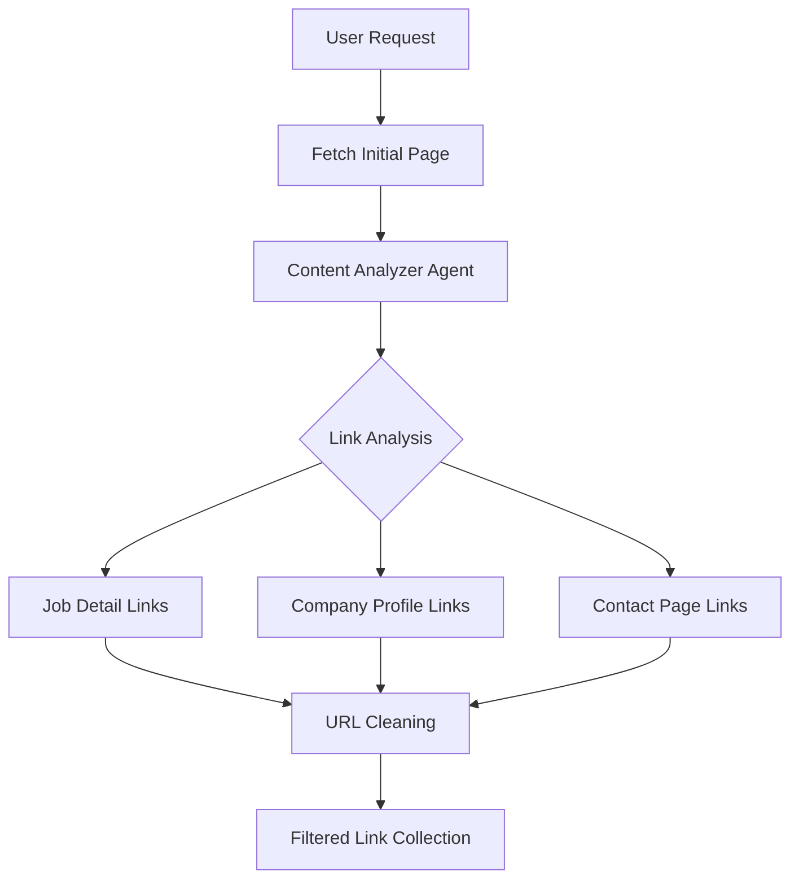
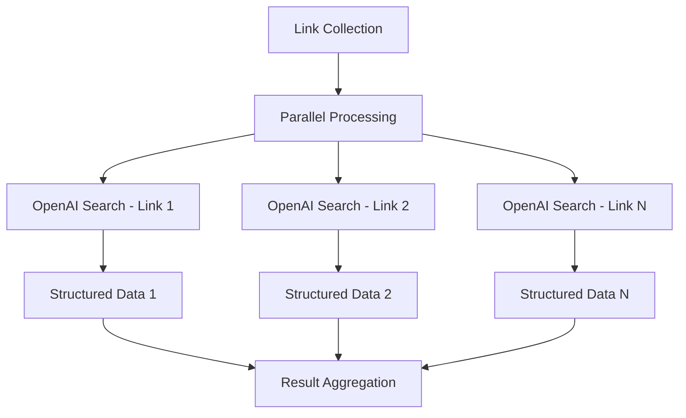
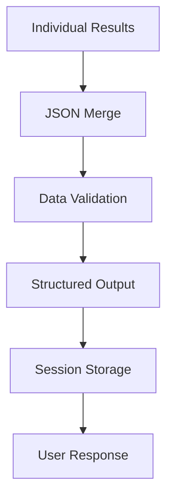

# AI Scrapper - System Design & Architecture

## 🎯 Overview

The AI Scrapper is a sophisticated multi-agent web scraping system that intelligently extracts structured data from websites using OpenAI's advanced AI capabilities. The system employs a three-stage workflow: **Link Discovery** → **Parallel Data Extraction** → **Result Combination**.

## 🏗️ High-Level Architecture

```
┌─────────────────┐    ┌──────────────────┐    ┌─────────────────┐
│   React UI      │    │   FastAPI        │    │   Multi-Agent   │
│   (Frontend)    │◄──►│   Server         │◄──►│   System        │
│                 │    │   (api.py)       │    │   (main_agents) │
└─────────────────┘    └──────────────────┘    └─────────────────┘
                                │
                                ▼
                    ┌──────────────────┐
                    │   Web Scraping   │
                    │   Engine         │
                    │   (Requests +    │
                    │    Selenium)     │
                    └──────────────────┘
                                │
                                ▼
                    ┌──────────────────┐
                    │   OpenAI API     │
                    │   Integration    │
                    │   (Search +      │
                    │    Analysis)     │
                    └──────────────────┘
```

## 🤖 Multi-Agent System Design

The system employs three specialized AI agents, each with distinct responsibilities:

### 1. **Request Classifier Agent**
```python
Role: Determines the type of user request
Input: User query/message
Output: Classification (scraping vs. Q&A)
Model: gpt-4.1-mini
```

**Decision Logic:**
- **Scraping Request**: Contains URLs or web scraping keywords
- **Q&A Request**: Follow-up questions about previously scraped data

### 2. **Regular Q&A Assistant**
```python
Role: Handles follow-up questions about scraped data
Input: User question + scraped data context
Output: Natural language answer
Model: gpt-4.1-mini
```

**Capabilities:**
- Analyzes previously scraped data
- Filters and aggregates information
- Provides contextual answers

### 3. **Content Analyzer Agent**
```python
Role: Intelligent link discovery and content analysis
Input: HTML content + user intent
Output: Relevant links (JSON array)
Model: gpt-4.1-mini
```

**Key Features:**
- **Intent-Aware Link Selection**: Matches link types to user requests
- **Context Filtering**: Avoids irrelevant links
- **Smart Categorization**: Job links vs. company pages vs. contact info

## 🔄 Web Scraping Workflow

### Phase 1: **Link Discovery**


### Phase 2: **Parallel Data Extraction**


### Phase 3: **Result Combination**


## 📊 Data Flow Architecture

### 1. **Request Processing Flow**
```
User Input → Request Classification → Route Decision
     ↓
Scraping Request: URL + Intent → Web Scraper
Q&A Request: Question + Context → Q&A Assistant
     ↓
Response Generation → Session Update → User Interface
```

### 2. **Scraping Data Flow**
```
URL → HTTP/Selenium Fetch → HTML Content
  ↓
Content Analysis → Link Extraction → URL Cleaning
  ↓
Parallel OpenAI Search → Data Extraction → JSON Results
  ↓
Result Combination → Structured Data → Session Storage
```

## 🛠️ Technology Stack

### **Backend Components**
- **FastAPI**: RESTful API server with async support
- **OpenAI API**: AI-powered content analysis and search
- **Requests**: HTTP client for web scraping
- **Selenium + Chrome**: Dynamic content handling
- **WebDriver Manager**: Automatic ChromeDriver management
- **BeautifulSoup**: HTML parsing (implicit)
- **Pydantic**: Data validation and serialization

### **Frontend Components**
- **React**: Modern UI framework
- **Webpack**: Module bundling
- **CSS**: Styling and responsive design

### **Infrastructure**
- **Docker**: Containerization and deployment
- **SQLite**: Session and conversation storage
- **Environment Variables**: Configuration management

## 🔧 Core Components Deep Dive

### **1. Content Analyzer Agent**
```python
# Intelligent Link Collection Strategy
ANALYSIS_PROCESS = {
    "step_1": "Analyze user intent (job details vs. company info vs. contact info)",
    "step_2": "Scan HTML for relevant link patterns",
    "step_3": "Filter links based on intent matching",
    "step_4": "Return curated link collection"
}

# Context-Aware Link Patterns
LINK_PATTERNS = {
    "job_details": ["/jobs/[id]", "/position/[title]", "/apply/[job]"],
    "company_info": ["/company/[name]", "/about", "/organization/[id]"],
    "professional_profiles": ["/doctor/[name]", "/profile/[professional]"],
    "contact_info": ["/contact", "/about", "directory with contact details"]
}
```

### **2. OpenAI Search Integration**
```python
# Enhanced Search Configuration
SEARCH_CONFIG = {
    "model": "gpt-4.1-mini",
    "web_search_options": {
        "search_context_size": "high"  # Maximum context for accuracy
    },
    "anti_dummy_enforcement": True,  # Prevents generic/dummy responses
    "parallel_processing": True      # Concurrent link processing
}
```

### **3. URL Processing Pipeline**
```python
# URL Cleaning and Standardization
URL_PROCESSING = {
    "relative_to_absolute": "urljoin(base_url, relative_url)",
    "query_parameter_removal": "urlparse → clean → urlunparse",
    "fragment_removal": "Remove #anchors for clean URLs",
    "deduplication": "Unique URL collection"
}
```

## ⚡ Performance Optimizations

### **1. Parallel Processing**
- **Concurrent OpenAI Searches**: `asyncio.gather()` for simultaneous API calls
- **Non-blocking Operations**: Async/await pattern throughout
- **Batch Processing**: Multiple links processed simultaneously

### **2. Intelligent Caching**
- **Session Management**: SQLite-based conversation history
- **Context Preservation**: Scraped data available for follow-up questions
- **Deduplication**: Prevents redundant scraping

### **3. Error Handling & Resilience**
- **Multi-level Fallbacks**: Requests → Selenium → Manual parsing
- **ChromeDriver Management**: Automatic version matching with WebDriver Manager
- **Graceful Degradation**: Continues processing even if individual links fail

## 🔍 Request Classification Logic

```python
def classify_request(user_input):
    """
    Classification Decision Tree:
    
    1. Contains URL? → Scraping Request
    2. Contains scraping keywords? → Scraping Request
    3. References previous data? → Q&A Request
    4. General question? → Q&A Request
    """
    
    SCRAPING_INDICATORS = [
        "urls", "scrape", "extract", "crawl", 
        "get data from", "find information on"
    ]
    
    QA_INDICATORS = [
        "from the scraped", "previously scraped",
        "from the results", "which jobs", "how many"
    ]
```

## 📈 Scalability Considerations

### **1. Horizontal Scaling**
- **Stateless Design**: Each request is independent
- **Container-Ready**: Docker-based deployment
- **Load Balancing**: FastAPI supports multiple workers

### **2. Resource Management**
- **Chrome Resource Limits**: Headless mode with optimized flags
- **Memory Management**: Selenium driver cleanup after each use
- **API Rate Limiting**: Controlled OpenAI API usage

### **3. Data Storage**
- **Session Isolation**: User-specific data storage
- **Efficient Querying**: Structured data format for fast retrieval
- **Storage Cleanup**: Configurable session retention

## 🔐 Security & Configuration

### **1. Environment Management**
```bash
# Required Configuration
OAI_API_KEY=sk-proj-...          # Primary API key
OPENAI_API_KEY=sk-proj-...       # Library compatibility
CHROME_OPTIONS=--headless...     # Browser security flags
```

### **2. Security Features**
- **API Key Protection**: Environment variable isolation
- **Chrome Sandboxing**: Secure browser execution
- **Input Validation**: Pydantic model validation
- **CORS Protection**: Controlled cross-origin requests

## 🎯 Use Cases & Applications

### **1. Job Scraping**
```
Input: "https://jobsite.com - Get all job titles, salaries, and locations"
Process: Job detail links → Parallel extraction → Structured job data
Output: [{title, salary, location, company}, ...]
```

### **2. Professional Directories**
```
Input: "https://medical-directory.com - Find all doctors with their specialties"
Process: Doctor profile links → Parallel extraction → Professional data
Output: [{name, specialty, contact, credentials}, ...]
```

### **3. Business Listings**
```
Input: "https://business-directory.com - Get company contact information"
Process: Company detail links → Parallel extraction → Contact data
Output: [{company, phone, email, address}, ...]
```

## 📋 Data Models & Structures

### **Core Data Models**
```python
class SearchResult(BaseModel):
    url: str
    extracted_data: Dict[str, Any]
    success: bool
    error_message: Optional[str]

class ScrapeResult(BaseModel):
    total_links_processed: int
    successful_extractions: int
    failed_extractions: int
    results: List[SearchResult]
    combined_data: List[Dict[str, Any]]

class RequestClassification(BaseModel):
    request_type: str  # "scraping" or "qa"
    confidence: float
    reasoning: str
```

## 🔄 Session Management Flow

```
User Request → Session Check → Context Retrieval
     ↓
Process Request → Update Session → Store Results
     ↓
Response Generation → Session Update → Context Preservation
```

This architecture enables the AI Scrapper to handle complex web scraping tasks intelligently while maintaining conversation context and providing accurate follow-up question support. 